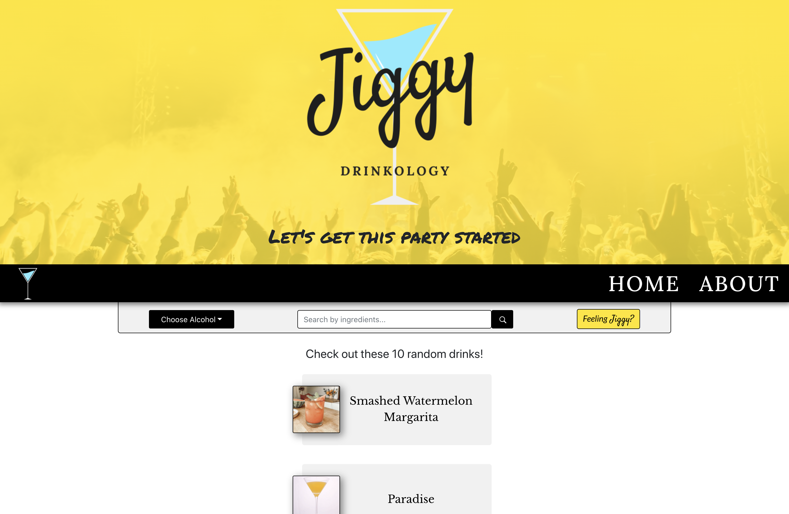

# Welcome to [Jiggy - Drinkology](https://jiggydrinkology.netlify.app/) 

Got a full liquor cabinet and don't know what to make? [Jiggy](https://jiggydrinkology.netlify.app/) can help you. 

## How it works

Jiggy allows you to search for cocktails you can make just by telling us which alcohols and ingredients you have on hand. If you're "Feeling Jiggy", we'll suggest 10 random drinks to make. If you are more curious about the type of liquor you have, select it in the drop-down menu to learn more about it and see drinks you can make. 

## Motivation 

This application is a pandemic-inspired collaboration between three friends. We wanted to create something that our friends could use to make light of their time stuck inside during quarantine. Now that you now have the time, Jiggy is the tool you've been waiting for to help clear out your adult beverage cupboard.



## Important links
- [Deployed application](https://jiggydrinkology.netlify.app/)
- [The Cocktail DB (RapidAPI)](https://rapidapi.com/thecocktaildb/api/the-cocktail-db)
- [TheCocktailDB (official site)](https://www.thecocktaildb.com/)

## Implemented Technologies

Jiggy is a **React** application that consumes RapidAPI's "Cocktail DB" API and database. We employed different **Axios** calls to hit various endpoints of the API - all of which are GET requests (v2.x). **useState** and **useEffect** hooks help manage the state of each functional component. Jiggy is styled with **Sass**, allowing for better organization and consistency throughout the application. 

## Developer commands

Follow these steps to run the application locally: 
- Clone the repo to a local directory
- Install dependancies by running ```npm install``` 
- Spin up a local server by running ```npm run start```

## Future versions

- If search comes up empty, return drinks with some of the ingredients that the user entered
- Drizly Integration - Allow users to shop for missing ingredients/alcohols
- Allow user to sign in and add drinks to "favorites" list

## Related